## Teaching statistics for the future
### Outline of the talk
1. What I supposedly do during the day
2. A brief taxonomy and history of online educational models
3. Massive Open Online Courses (MOOCs) 
4. JHU Biostat involvement in Coursera
5. Novel moving target directions of the field statistics
6. **Data Science series** 
7. swirl

---

## About these slides
* HTML5 using (customized) [Google io2012 style](https://code.google.com/p/io-2012-slides/)
* Created using [slidify](http://slidify.org)
* Appear on github at (https://github.com/bcaffo/MOOCtalk) fork if you'd like
* Jointly written with my collaborators Jeff, Roger, Nick and Sean
* CC licensed by-nc-sa

---
## Thanks to the dean

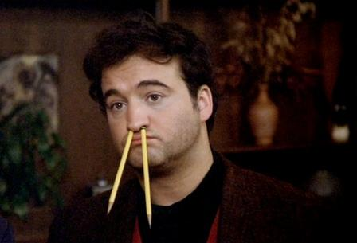

>- For taking time out of his busy schedule of cracking down on Delta Tau Chi for
this talk

---
## You know you've made it when

---
## Core team

--- &twocol w1:50% w2:50%
## Plus generous contributions from the

*** =left
- [Department of Biostatistics](http://www.biostat.jhsph.edu)
- [Center for Teaching and Learning](http://www.jhsph.edu/offices-and-services/center-for-teaching-and-learning/)
- [Bloomberg School of Public Health](http://www.jhsph.edu)
- [Johns Hopkins University](http://www.jhu.edu)
- [Coursera](http://coursera.org)
- Steve, Mike, Karen, Sukon

*** =right
- Everyone at CTL
- Everone at Multimedia 
- Team SWIRL
- Lauren and Ethan (Brian's 2013 interns)
- Contributions from github pull requests
- Tolerant families!
- 800 thousand intrepid self learners

---
## My day job(s)
### SMART (www.smart-stats.org)

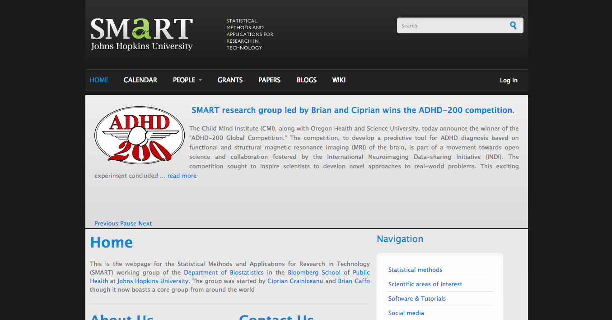

---
## Connectomics
### resting state fMRI

 

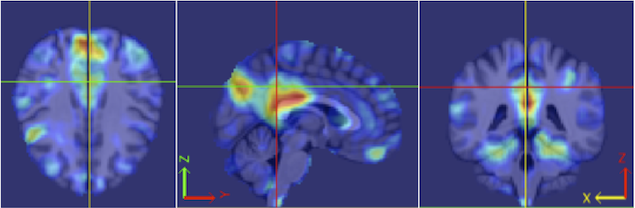

--- &twocol w1:50% w2:50%
## (Incomplete) characteristics of educational systems

*** =left
- Online / in person / blended
- Active/participatory/interactive learning
- Scalable / non-scalable
- Low cost / high cost / freemium
- Student paced / teacher paced
- Open / restricted access

*** =right
- Flipped / lecture style / blended 
- Open / closed source content
- Instructor interaction
- Credentialing 
- Funding model

---
## Examples
- Traditional in person teaching generally has characterists of: in person, lecture style, non-scalable, high cost, restricted access with a large amount of instructor interaction valued credentialing
- "Tranditional" online courses are online or blended online and in person and otherwise try to approximate traditional in person classes. 
- Online interactive learning (OIL Code School, Code academy) primary characteristics are student-paced interactive learning
- Intelligent tutoring systems (swirl), like OILs just not necessarily online
- Khan Academy is online, interactive, scalable and low cost
- Other modalities : iTunes U, OpenCourseware, Udemy

---
## MOOCs 

Primary characteristics are open access, low cost, scalable, online 

### (every letter is negotiable, from Wikipedia citing Mathieu Plorde)

<a href=http://www.flickr.com/photos/23311795@N04/8620174342>
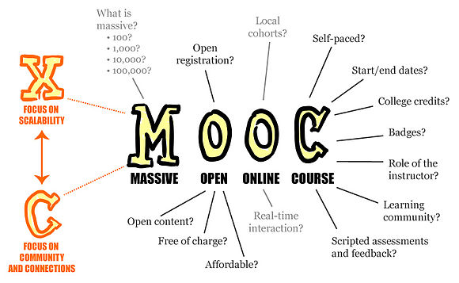
</a>

---
## Most visible MOOC instruction sites

---
## Also
### Several university/organization-specific sites, platforms and content delivery systems
- Stanford, CMU, Duke, Harvard, MIT, google ...
- Varying degrees of content/delivery
- EdX platform has been open sourced
- Google course builder (now contributing to EdX)
- Massive amount of development going into platforms and instruction sites/portals

---
## Coursera platform, videos

--- &twocol w1:50% w2:50%

*** =left
## Example videos 
### (on YouTube)

- [Example from data science inference](https://www.youtube.com/watch?v=ZD7kR4QLFnE#t=269)
- [Ad hoc phone recording](https://www.youtube.com/watch?v=ZeS-ELmY7Fk)

*** =right
## Equipment

- [Cintiq 22inch display](http://www.wacom.com/en/us/creative/cintiq-22-hd)
- [Yeti usb microphone](http://bluemic.com/yeti/) 
- [Camtasia](http://www.techsmith.com/camtasia.html)
- [Note 2](http://www.samsung.com/global/microsite/galaxynote/note2/index.html?type=find)
- [Lecture notes](https://play.google.com/store/apps/details?id=com.acadoid.lecturenotes)
- [ffmpeg](http://www.ffmpeg.org/)

---
## Coursera platform, quizzes

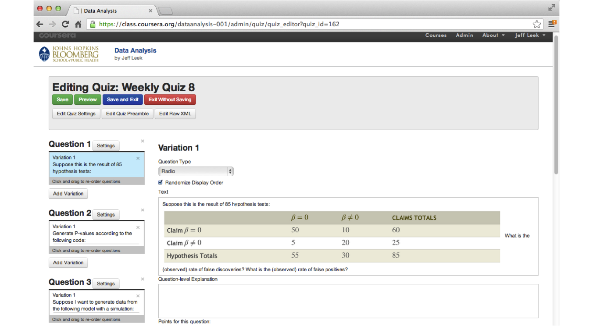

---
## Coursera platform, peer grading

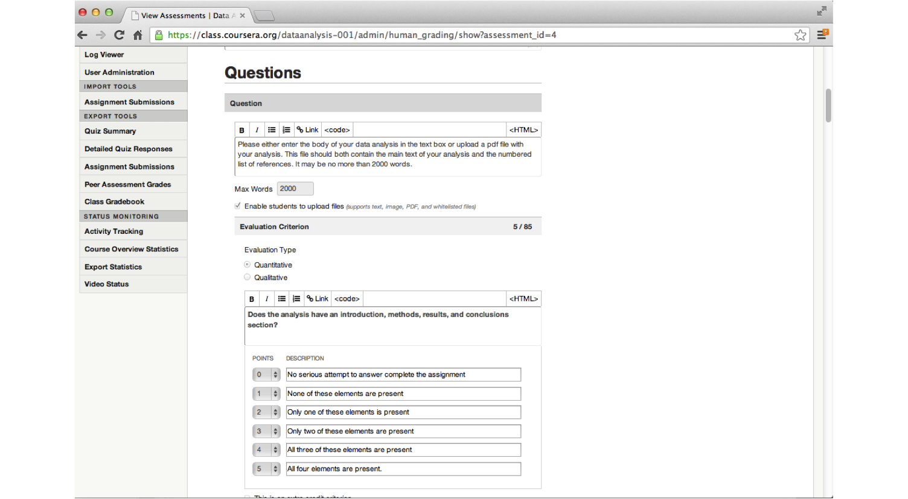

---
## Coursera platform, forums
### You're on the internets
(Forums can be brutal)

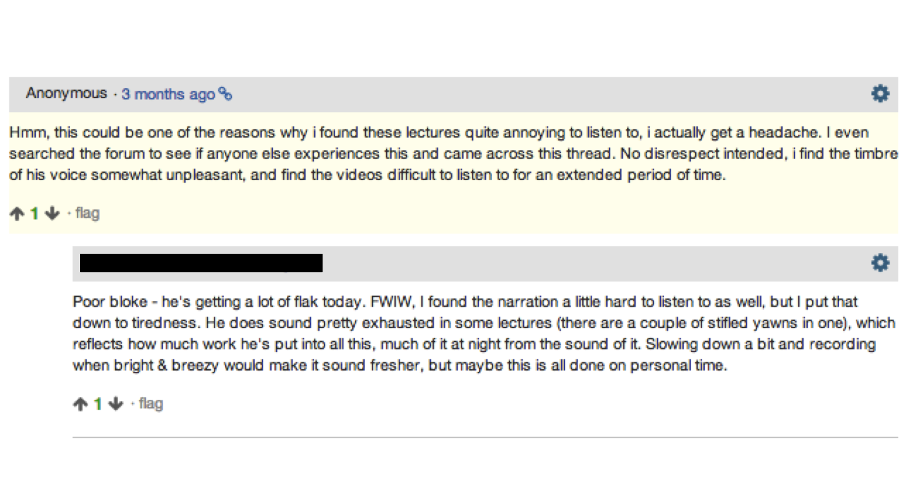

--- 
## Johns Hopkins Biostat Coursera classes
### Original three
* Brian Caffo, Roger Peng, Jeff Leek
* Run 09/2012, 09/2012, 01/2013

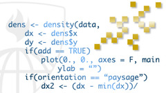

---
## Enrollments by class and offering
<iframe src="../fig/classPlot2.html" width=100%, height=600></iframe>

---
## Statements of accomplishment by offering
<iframe src="../fig/classPlot3.html" width=100%, height=600 ></iframe>

---
## Over time
<!-- MotionChart generated in R 3.0.3 by googleVis 0.5.2 package -->
<!-- Thu May 08 21:37:41 2014 -->

<!-- jsHeader -->

 
<!-- jsChart -->  

 
<!-- divChart -->
  

---
## Over time, MBBC 1
<iframe src="../fig/classPlot5.html" width=100%, height=600></iframe>

----
## Cumulative enrollment over all classes over time
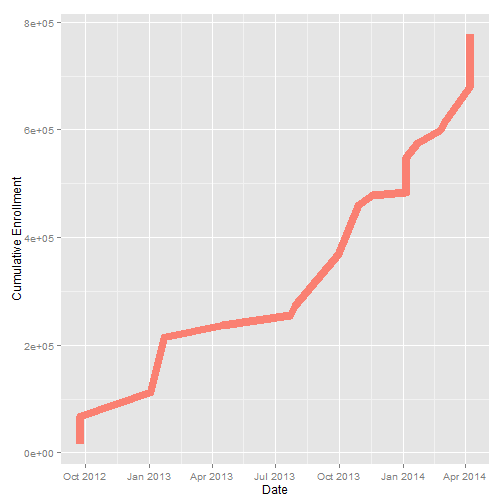

---
## Completion rates
* Students participate in MOOCs for a variety of reasons
* Numerous students sign up for a course, but do not 
actively participate
* Recent MBBC 1
  * 17K students
  * 10K accessed the course site ever
  * 7K watched any video ever
  * 2K submitted any quiz
  * 196 earned a SOA
  * 129 signature track
  * 128 posted to the forums

--- 
## Some summary statistics
* Classes considered are MBBC1, MBBC2, CDA, DA, Case, StatReas, fMRI, Tools, Rprog, Clean
* A total of 776,691 students enrolled  
* 19 class offerings

* Average of 40,878 students per class
* Minimum class size of 6,742 for class
MBBC2 offering 2
* Maximum class size of 101,747 for class
DA offering 1

---
## Signature track

- Verification based on typing patterns (highly unique according to Coursera)
  - Secondary verification via webcams
- Coursera gives student aid
- Revenue distribution via agreement between Coursera and partner institution
- 155 signature track for 20k students in MBBC1 V4
- Much higher retention and completion rates for signature track
- Between 1% and 12% Signature track rate for classes (depending on a variety of factors)
- All of our classes are $49 for sig track

--- &twocol w1:50% w2:50%
## Interesting fallout from doing this

*** =left
- Jeff's class was listed as one of the top 10 most enrolled Coursera classes
  - Roger's class has since eclipsed it in cumulative enrollment
- Brian, Roger, Martin, John have run signature track ($49 per student)
- Brian's class featured on the front page of the Washington Post 
- Roger interviewed on Anderson Cooper and NPR

*** =right
- Scott Zeger introduced class *Cased Based Introduction to Statistics*
- Brian introducted *MBBC2*
- Martin Lindquist introduced *Statistical Analysis of fMRI Data*
- John McGready introduced *Statistical Reasoning for Public Health*

---
## MOOCs by university
<iframe src="../fig/classPlot6.html" width=100%, height=600 ></iframe>

  
---
## Case studies

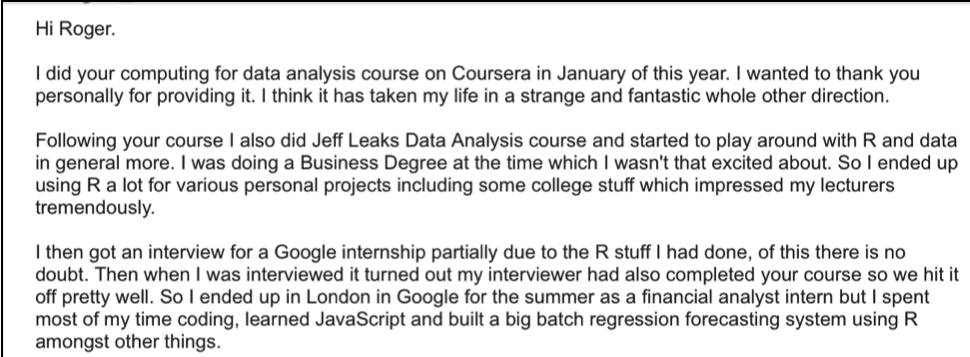

---
## Case studies

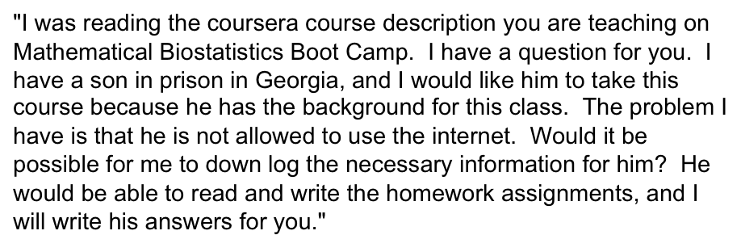

---
## Case studies

<a href = "https://twitter.com/ahalterman/status/425805189380308992">
    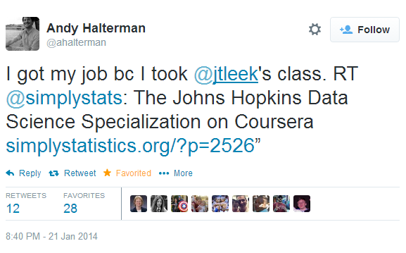
</a>

---
## Statistics, big data, data science

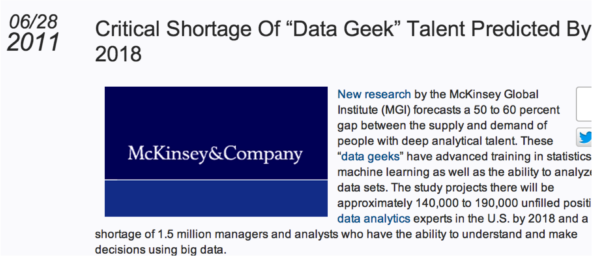

---
## Complimentary problems

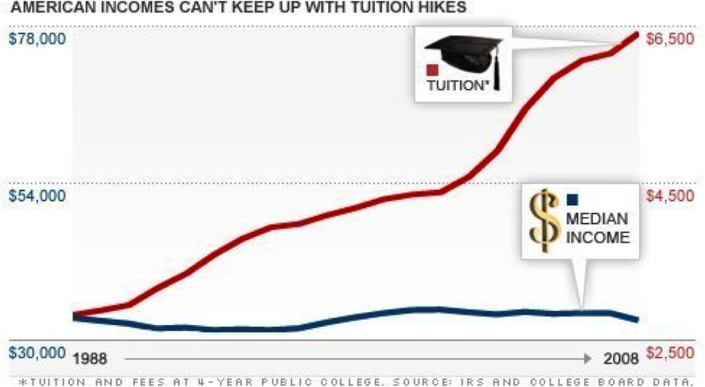

---
## Johhs Hopkins Data Science Specialization
### Codirected and taught by Roger Peng, Jeff Leek and Brian Caffo

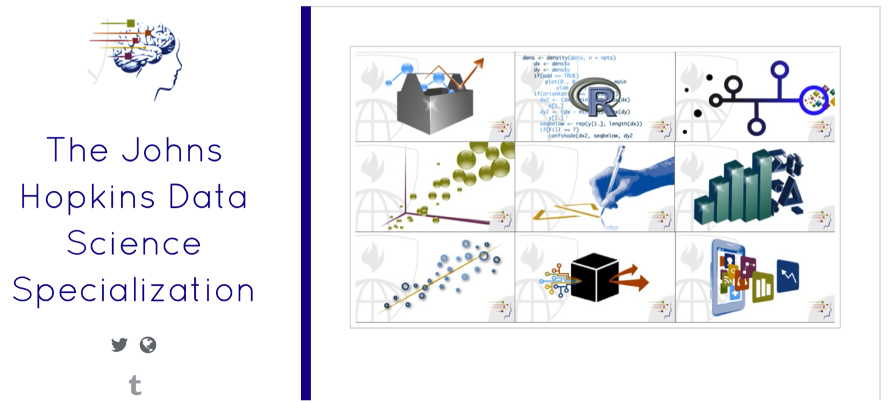

---
## Courses

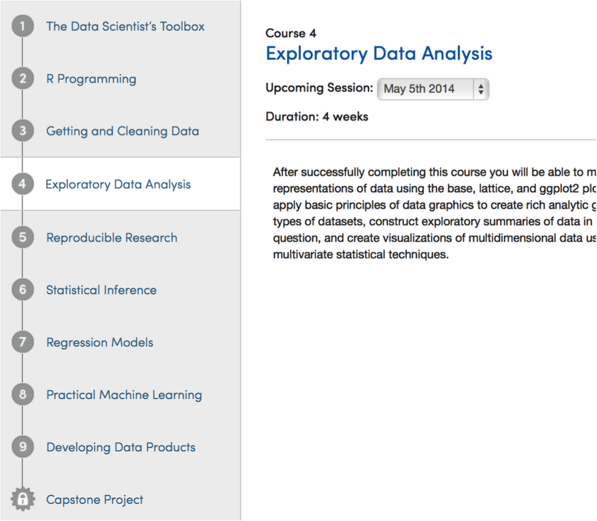

---
## Specialization certificate

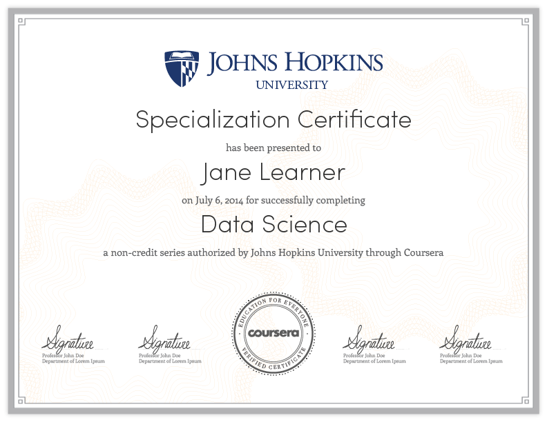

--- &twocol w1:50% w2:50%
## Unique aspects of the program
*** =left
- Completely redesigned stat curriculum
- 9 signature track courses
- 1 capstone project course
- Total cost (modular) $490
  - $49 per sig track for 10 classes

*** =right
- Each class is four weeks
- Quizzes, in video quizzes, programming assignments and peer assessment projects
- Run monthly after initial rollout
- All content open source
- Toolbox, R Programming and Getting and Cleaning Data have all run
(enrollments of 64k, 62k, 34k resp)

--- 
## Platform choices
- Everything done on Coursera
- All programming in R
- All lecture notes done in Slidify (common theme)
- All content open source
- Version control through git and github
- (Students will learn and use git)
- RStudio as an IDE
- knitr for reproducible documents and report writing

---  &twocol w1:50% w2:50%
## Standard and non-standard stat content 
*** =left
- Basic probability and math stat
- Statistical inference
  - Hypothesis tests, confidence intervals, likelihood
  - Brief intro to Bayesian analysis
- Regression and generalized linear models
- Statistical machine learning
- EDA
- Data analysis

*** =right
- Reproducible research, report generation
- Presentations
- Interactive graphics (rCharts, shiny, manipulate, googleVis)
- Data munging, obtaining data
- Programming
- Plotting (ggplot2, rCharts, R base graphics)
- Capstone project

---
## Shiny is pretty neat

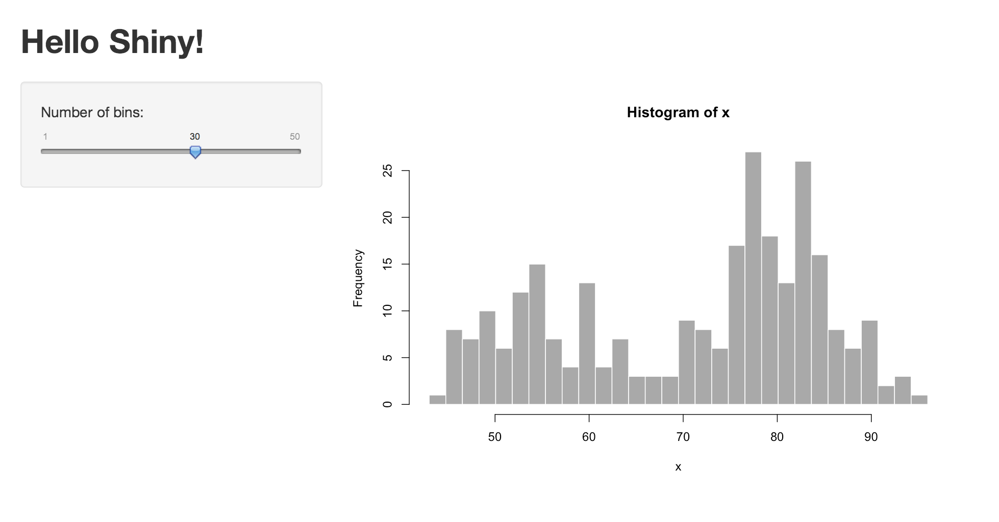

* [Shiny example John Muschelli's app](https://muschellij2.shinyapps.io/ENAR_2014/)
* [Rawan Allozi's algorithm](http://spark.rstudio.com/bcaffo/pta/)
* Rstudio is giving free hosted shiny apps for students in the concentration!

---
## Capstone industry partnerships
* Current negotiations are ongoing for exciting capstone projects
* Company donates the data to the Specialization that the students analyze for their project
    * Prepare video or documentation outlining the problem
* University MOUs being finalized with some of the most exciting tech companies

---
## Cost comparison with other programs

---
 
 
 

---
## A friendlier way to learn R...

---
## Self-paced and interactive

---
## Learn R and stats, together

---
## swirl + Coursera

---
## Get Coursera credit, automatically

---
## Make your own interactive content

---
## swirlstats.com

---

 
 
 
 
 
 

---
Thanks!
=========
* Jeff, Roger, Nick, Sean, Ira
* Johns Hopkins
* Bloomberg School of Public Health
* Department of Biostatistics
* SMART group
    * Ciprian, Martin, Ani, Vadim
* Students

---
## My peeps

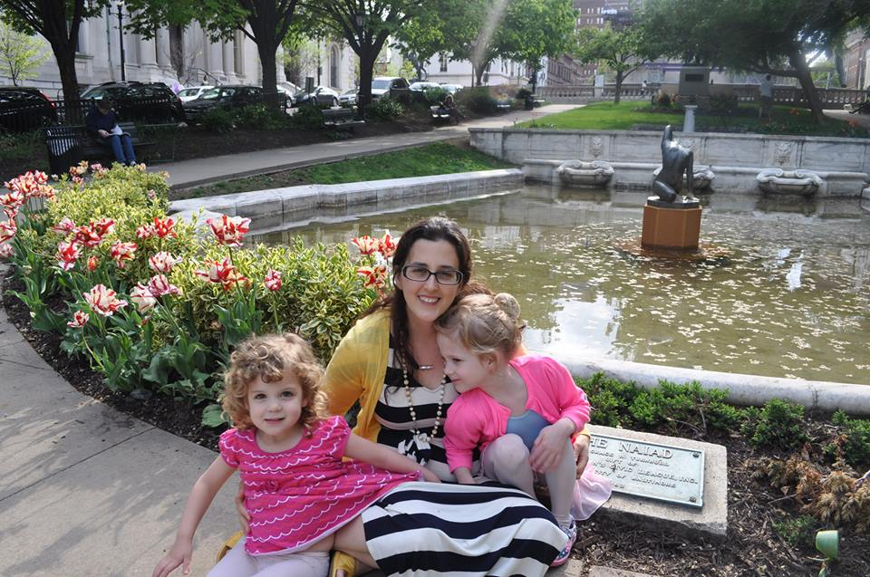

--- 
## Version test2 

