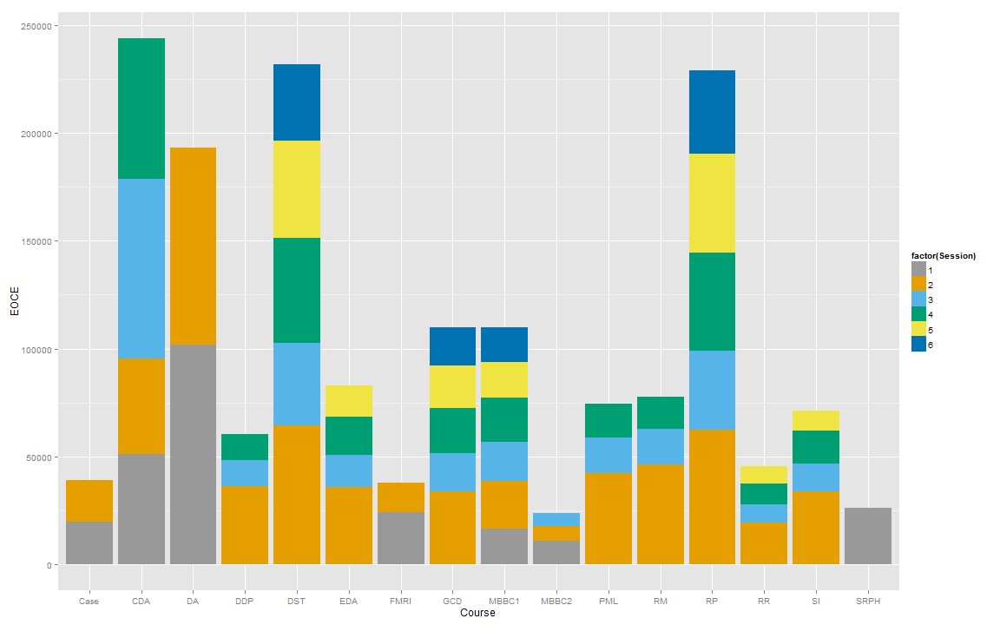
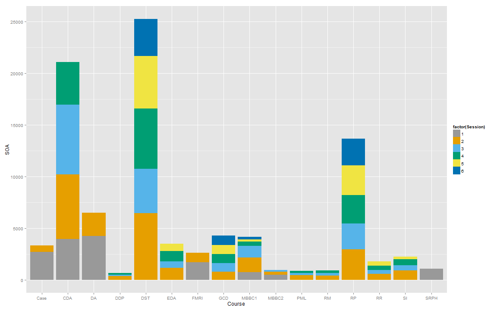
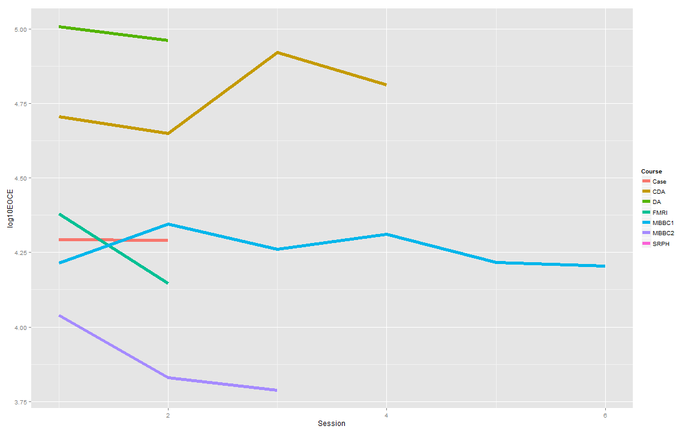
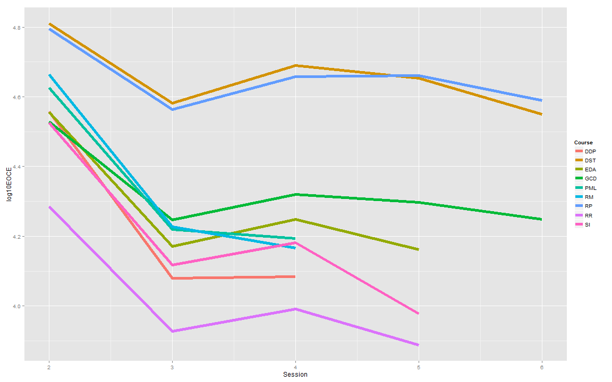
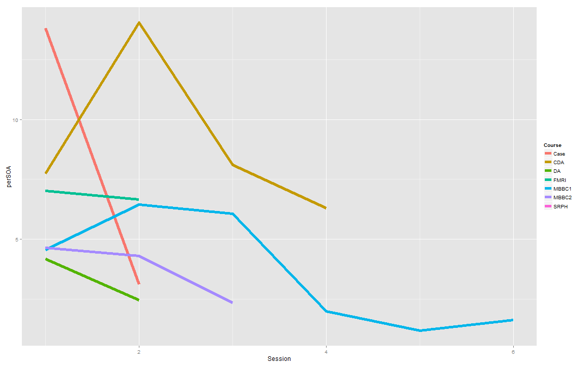

Teaching statistics for the future: the MOOC revolution and beyond
========================================================
author: Brian Caffo, PhD
date: 09/20/2014
transition: rotate

Outline of the talk
========================================================
1. Who am I?
2. A brief taxonomy and history of online educational models
3. Massive Open Online Courses (MOOCs) 
4. JHU Biostat involvement in Coursera
5. Novel moving target directions of the field of statistics
6. **Data Science Specialization** 
7. swirl

Slides
========================================================
- HTML5 using Rstudio presenter
- Appear on github at (https://github.com/bcaffo/MOOCtalk) fork if you'd like
- Jointly written with my collaborators Jeff Leek and Roger Peng
- CC licensed by-nc-sa

Core team
========================================================

Plus generous contributions from the
===
- [Department of Biostatistics](http://www.biostat.jhsph.edu)
- [Center for Teaching and Learning](http://www.jhsph.edu/offices-and-services/center-for-teaching-and-learning/)
- [Bloomberg School of Public Health](http://www.jhsph.edu)
- [Johns Hopkins University](http://www.jhu.edu)
- [Coursera](http://coursera.org)
- Team swirl
- Lauren and Ethan (Brian's 2013 interns)
- Contributions from github pull requests
- Tolerant families!
- Over a million intrepid self-learners

My day job(s)
===
### SMART (www.smart-stats.org)

Connectomics
===
### resting state fMRI

 

Educational systems
===
- Online / in person / blended
- Active/participatory/interactive learning
- Scalable / non-scalable
- Low cost / high cost / freemium
- Student paced / teacher paced
- Open / restricted access

***

- Flipped / lecture style / blended 
- Open / closed source content
- Instructor interaction
- Credentialing 
- Funding model

Massive Open Online Courses
===
Primary characteristics are open access, low cost, scalable, online 

(every letter is negotiable, from Wikipedia citing Mathieu Plorde)

Most visible MOOC instruction sites
===

Coursera platform, videos
===

Example videos (on YouTube)
===
Important number: production time per hour of video time

- [Example from data science inference](https://www.youtube.com/watch?v=ZD7kR4QLFnE#t=269)
- [Recent better work](https://www.youtube.com/watch?v=gyHiO-vDDC4)

Equipment
===
- [Portable green screen with lights](http://www.amazon.com/Chromakey-Lighting-Backdrop-Included-U15/dp/B003UOOTCS/ref=sr_1_1?s=electronics&ie=UTF8&qid=1411272858&sr=1-1&keywords=green+screen+kit)
- [Cintiq 22inch display](http://www.wacom.com/en/us/creative/cintiq-22-hd)
- [Yeti usb microphone](http://bluemic.com/yeti/) 
- [Camtasia](http://www.techsmith.com/camtasia.html)

Coursera platform, quizzes
===

Coursera platform, peer grading
===

Coursera platform, forums
===
### Main source for student interaction
(Forums can be brutal)

Johns Hopkins Biostat Coursera classes
===
### Original three
* Brian Caffo, Roger Peng, Jeff Leek
* Run 09/2012, 09/2012, 01/2013

End of course enrollments
===
 

End of course SOA
===
 

Log10 enrollment over session, non DSS
===
 

Log10 enrollment over session DSS
===
 

Percent SOA over sessions non-DSS
===
 

Percent SOA over session DSS
===
 

Important consideration about completion rates
===
* Students participate in MOOCs for a variety of reasons
* Numerous students sign up for a course, but do not 
actively participate
* Recent MBBC 1
  * 17K students
  * 10K accessed the course site ever
  * 7K watched any video ever
  * 2K submitted any quiz
  * 196 earned a SOA
  * 129 signature track ($6k in gross revenue)
  * 128 posted to the forums

Some summary statistics
===
* A total of 1,656,654 enrollments 
* A total of 92,812 SOAs issued
* 16 Unique classes
* 56 class offerings
* Average of 29,583 students per class.
* Minimum class size of 6,139 
* Maximum class size of 101,747

Signature track
===

- Verification based on typing patterns (highly unique according to Coursera)
  - Secondary verification via webcams
- Coursera gives student aid
- Revenue distribution via agreement between Coursera and partner institution
- Much higher retention and completion rates for signature track

Case studies
===

Case studies
===

Case studies
===

Statistics, big data, data science
===

Complimentary problems
===

Johhs Hopkins Data Science Specialization
===
### Codirected and taught by Roger Peng, Jeff Leek and Brian Caffo

Courses
===

Specialization certificate
===

Program format
===
- 9 signature track courses
- 1 capstone project course
- Total cost (modular) $490
  - $49 per sig track for 10 classes

***
- Each class is four weeks
- Quizzes, in video quizzes and peer assessment projects
- Run monthly after initial rollout
- All content open source

Platform choices
===
- Everything done on Coursera
- All programming in R
- All lecture notes done in Slidify (common theme)
- Version control through git and github
  - **All content open source**
  - (Students will learn and use git)
  - All code and data available in slides
- RStudio as an IDE
- knitr for reproducible documents and report writing

Standard and non-standard stat content 
===
- Basic probability and math stat
- Statistical inference
- Regression and generalized linear models
- Statistical machine learning
- EDA
- Machine learning
- Training wheel data analysis

*** 
- Reproducible research, report generation
- Presentations
- Interactive graphics 
- Data munging, obtaining data
- Plotting software
- Capstone project
- Actual data analysis

 
===
 
 
 

A friendlier way to learn R...
===

Self-paced and interactive
===

Learn R and stats, together
===

swirl + Coursera
===

Get Coursera credit, automatically
===

Make your own interactive content
===

swirlstats.com
===

 
====

 
 
 
 
 
 

