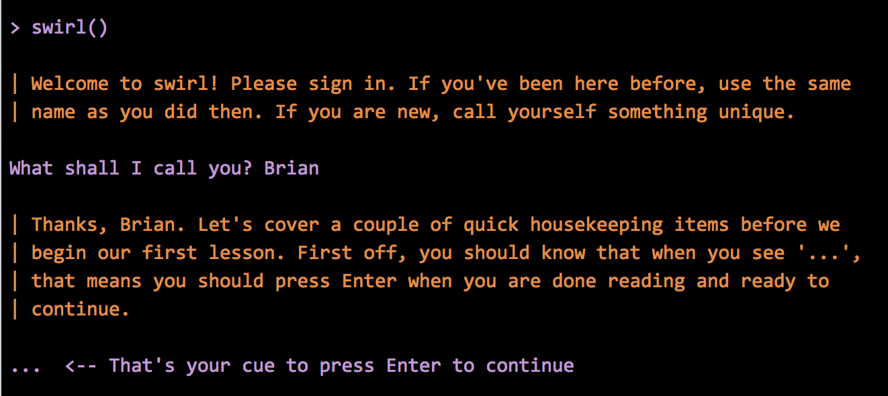
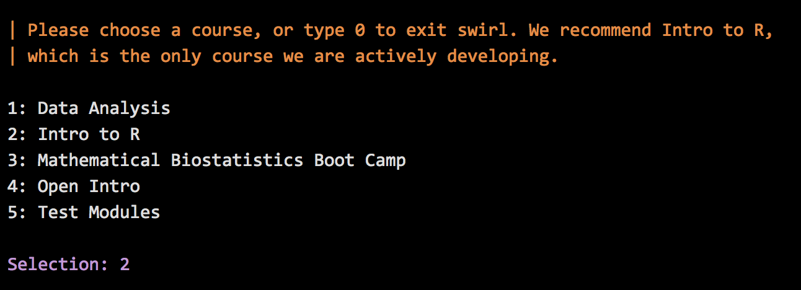
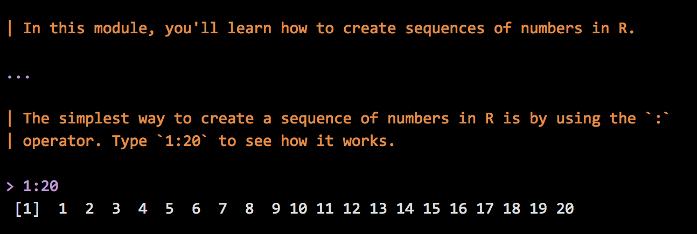
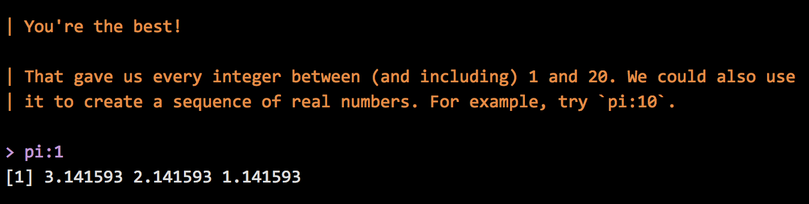
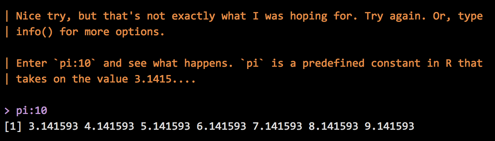
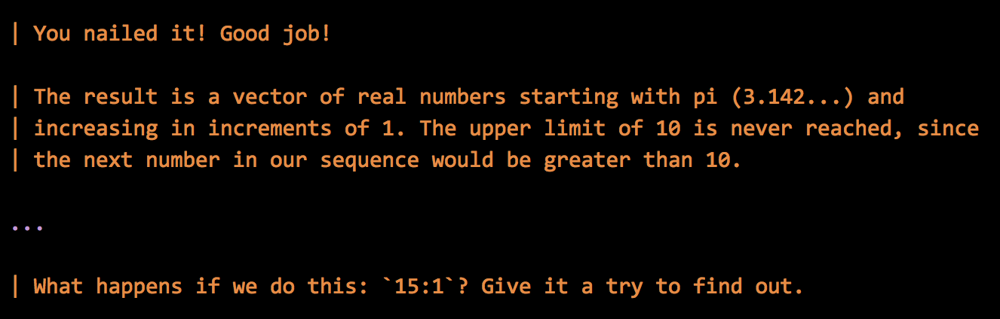
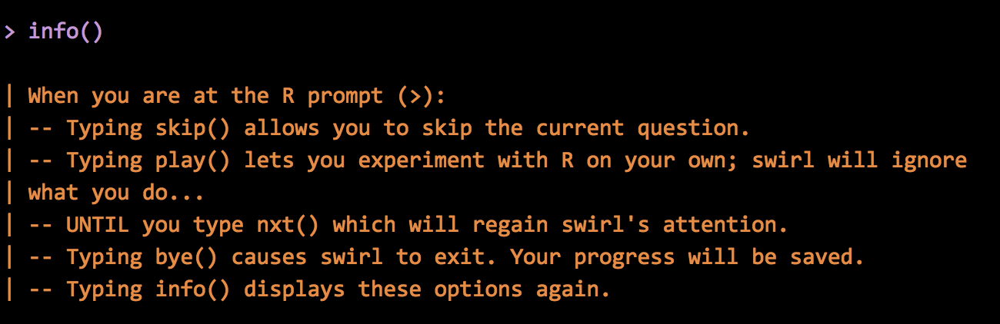
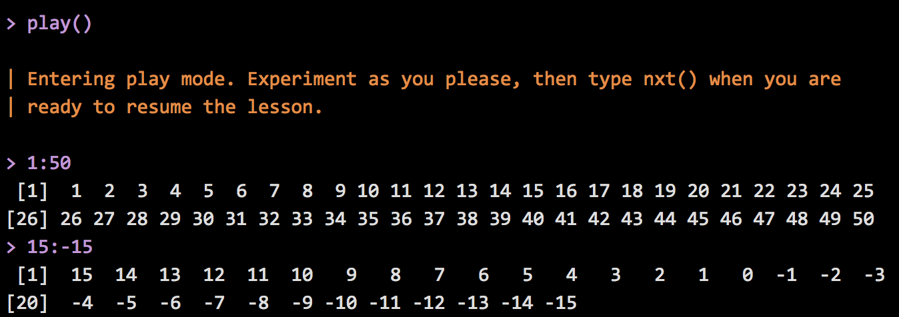
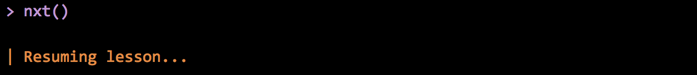
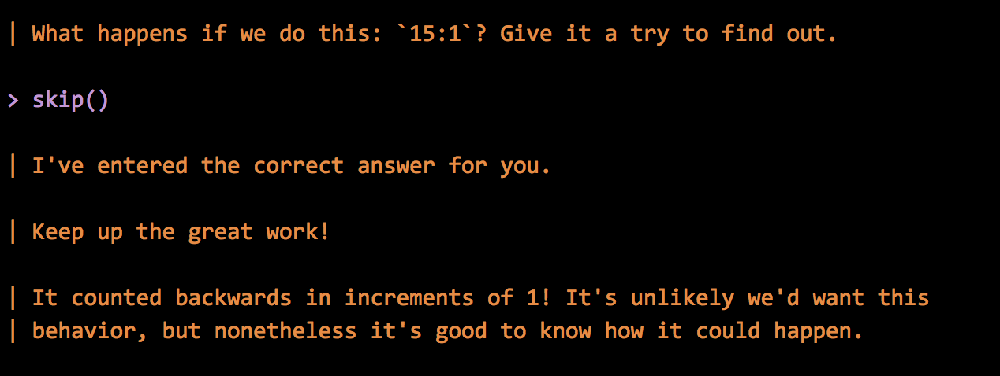

---
## Teaching statistics for the future
### Outline of the talk
1. Who the heck am I?
2. A brief taxonomy and history of online educational models
3. Massive Open Online Courses (MOOCs) 
4. JHU Biostat involvement in Coursera
5. Novel moving target directions of the field statistics
6. **Data Science series** 
7. SWIRL

---
## About these slides
* HTML5 using (customized) [Google io2012 style](https://code.google.com/p/io-2012-slides/)
* Created using [slidify](http://slidify.org)
* Appear on github at (https://github.com/bcaffo/MOOCtalk) fork if you'd like
* Jointly written with my collaborators Jeff Leek and Roger Peng
* CC licensed by-nc-sa

---
## Core team

<div align="center">


</div>

<div align="center">


</div>

---
## Plus generous contributions from the
- [Department of Biostatistics](http://www.biostat.jhsph.edu)
- [Center for Teaching and Learning](http://www.jhsph.edu/offices-and-services/center-for-teaching-and-learning/)
- [Bloomberg School of Public Health](http://www.jhsph.edu)
- [Johns Hopkins University](http://www.jhu.edu)
- [Coursera](http://coursera.org)
- Team SWIRL
- Lauren and Ethan (Brian's 2013 interns)
- Contributions from github pull requests
- Tolerant families!
- A half of a million intrepid self learners

---
## My day job(s)
### SMART (www.smart-stats.org)
<div align="center">

</div>

---
## Connectomics
### resting state fMRI
<div align="center"></div>
<br>
<div align="center">
</div>


---
## JHU Biostat onsite degree programs


1. PhD program 
  - Around 50 students with around 10 matriculating per year.
  - Around 200 applications per year.
2. ScM program
  - Around 25 students with around 10 matriculating per year.
  - Around 50 applications per year. 
3. Concurrent MHS program
  - Typically around 10 students with around 2 matriculating per year.
  - 2 - 4 applications per year 
4. Standalone MHS program


---
## My person teaching

- Biostat 751 and 2 
  - 16 weeks (8 x 2) of classes
  - Two 80 minute lectures per week
  - Two tests per term
  - Four homeworks per term
  - One TA
- About 10 students
- Covers intro methods and  (mostly) linear models at the doctoral level
- Recently I've introduced the flipped classroom model

--- &twocol w1:50% w2:50%
## (Incomplete) characteristics of educational systems

*** =left
- Online / in person / blended
- Active/participatory/interactive learning
- Scalable / non-scalable
- Low cost / high cost / freemium
- Student paced / teacher paced
- Open / restricted access

*** =right
- Flipped / lecture style / blended 
- Open / closed source content
- Instructor interaction
- Credentialing 
- Funding model

---
## Examples
> - Traditional in person teaching generally has characterists of: in person, lecture style, non-scalable, high cost, restricted access with a large amount of instructor interaction valued credentialing
> - "Tranditional" online courses are online or blended online and in person and otherwise try to approximate traditional in person classes. 
> - Online interactive learning (OIL Code School, Code academy) primary characteristics are student-paced interactive learning
> - Intelligent tutoring systems (SWIRL), like OILs just not online
> - Khan Academy is online, interactive, scalable and low cost
> - Other modalities : iTunes U, OpenCourseware, Udemy

---
## MOOCs 

Primary characteristics are open access, low cost, scalable, online 

### (every letter is negotiable, from Wikipedia citing Mathieu Plorde)
<div align="center">
<a href=http://www.flickr.com/photos/23311795@N04/8620174342>

</a>
</div>

---
## Most visible MOOC instruction sites
<a href=https://www.edx.org/>

</a>
<a href=https://www.udacity.com/>

</a>
<a href=https://www.udemy.com/>

</a>
<a href=https://corsera.rog/>

</a>

---
## Also
### Several university/organization-specific sites, platforms and content delivery systems
- Stanford, CMU, Duke, Harvard, MIT, google ...
- Varying degrees of content/delivery
- EdX platform has been open sourced
- Google course builder (now contributing to EdX)
- Massive amount of development going into platforms and instruction sites/portals

---
## Coursera platform, videos
<div align=center>

</div>

---
## Coursera platform, quizzes
<div align=center>

</div>

---
## Coursera platform, peer grading
<div align=center>

</div>

---
## Coursera platform, forums
### Main source for student interaction
(Forums can be brutal)
<div align=center>

</div>

--- 
## Johns Hopkins Biostat Coursera classes
### Original three
* Brian Caffo, Roger Peng, Jeff Leek
* Run 09/2012, 09/2012, 01/2013
<div align=center>


</div>

---
## Example course info
Course | Enrollment | Video | Quiz |
---|---|---|---|
MBBC 1 (v2) | 18,621 | 7,941 | 5,361s |
Computing for Data Analsis (v2) | 50,651 | 26,707 | 11,271 |
Data Analysis (v1) | 40,863 | 29,081 | 16,146 |

---
## Enrollments by class and offering
```{r, echo = FALSE, results = 'asis'}
require(rCharts)
myData <- data.frame(
enrollment = c(20671, 17481, 15636, 13517, 
                8274,  5279,     0,     0,
               84203,  54092,  44892,   38371,
               19631,  0    ,      0,       0,
               93136, 82240 ,      0,       0), 
video = c(NA, NA, NA, NA,
          NA, NA, NA, NA,
          NA, NA, NA, NA,
          13386, 0, 0, 0,
              0, 0, 0, 0),
date = c(NA, NA, NA, NA,
          NA, NA, NA, NA,
          NA, NA, NA, NA,
         "7/22/2013", NA, NA, NA,
         NA, NA, NA, NA),
soa = c(NA, NA, NA, NA,
        NA, NA, NA, NA,
        NA, NA, NA, NA,
        2712, 0, 0, 0,
        NA, NA, NA, NA),    
class = c(rep("MBBC1", 4), rep("MBBC2", 4), rep("CDA", 4), rep("Case", 4), rep("DA", 4)),
offering = as.character(c(2 : 4, 1, 
                          1 : 4, 
                          3, 4, 1, 2, 
                          1 : 4,
                          1 : 4))
)
myData <- myData[order(myData$offering),]
n1 <- nPlot(enrollment ~ class, group = "offering", data = myData, type = "multiBarChart")
n1$save('../fig/classPlot2.html', cdn = TRUE)
cat('<iframe src="../fig/classPlot2.html" width=100%, height=600></iframe>')
```

--- 
## Some summary statistics
* Classes considered are `r unique(myData$class)`
* A total of `r prettyNum(sum(myData$enrollment), big.mark=',', scientific = FALSE)` students enrolled  
* `r  sum(myData$enrollment != 0)` class offerings
```{r, echo = FALSE, results = 'hide'}
e <- myData$enrollment
avg <- sum(e) / sum(e != 0 )
noZero <- myData[e != 0,]
noZero <- noZero[order(noZero$enrollment),]
minE <- noZero$enrollment[1]
minEC <- noZero$class[1]
minES <- noZero$offering[1]
n <- nrow(noZero)
maxE <- noZero$enrollment[n]
maxEC <- noZero$class[n]
maxES <- noZero$offering[n]
``` 
* Average of `r prettyNum(avg, big.mark = ',', scientific = FALSE)` students per class.
* Minimum class size of `r prettyNum(minE, big.mark = ',', scientific = FALSE)` for class
`r minEC` offering `r minES`
* Maximum class size of `r prettyNum(maxE, big.mark = ',', scienfific = FALSE)` for class
`r maxEC` offering `r maxES`.


---
## Signature track

<div align="center">


</div>

- Verification based on typing patterns (highly unique according to Coursera)
  - Secondary verification via webcams
- Coursera gives student aid
- Revenue distribution via agreement between Coursera and partner institution
- 155 signature track for 20k students in MBBC1 V4
- Much higher retention and completion rates for signature track

--- &twocol w1:50% w2:50%
## Interesting fallout from doing this

*** =left
- Jeff's class was listed as one of the top 10 most enrolled Coursera classes
  - Roger's class has since eclipsed it in cumulative enrollment
- Brian and Roger have run signature track ($49 per student)
- Brian's class featured on the front page of the Washington Post 
- Roger interviewed on Anderson Cooper and NPR

*** =right
- Scott Zeger introduced class *Cased Based Introduction to Statistics*
- Brian introducted *MBBC2*
- Martin Lindquist introduced *Statistical Analysis of fMRI Data*
- John McGready introduced *Statistical Reasoning for Public Health*


---
## Case studies

<div align="center">

</div>

---
## Case studies

<div align="center">

</div>

---
## Statistics, big data, data science

<div align=center>

</div>

---
## Complimentary problems
<div align=center>

</div>

---
## Johhs Hopkins Data Science Specialization
### Codirected and taught by Roger Peng, Jeff Leek and Brian Caffo

<div align=center>

</div>

---
## Courses

<div align=center>

</div>

---
## Specialization certificate

<div align=center>

</div>

--- &twocol w1:50% w2:50%
## Unique aspects of the program
*** =left
- Completely redesigned stat curriculum
- 9 signature track courses
- 1 capstone project course
- Total cost (modular) $490
  - $49 per sig track for 10 classes

*** =right
- Each class is four weeks
- Quizzes, in video quizzes and peer assessment projects
- Run monthly after initial rollout
- All content open source

--- 
## Platform choices
> - Everything done on Coursera
> - All programming in R
> - All lecture notes done in Slidify (common theme)
> - All content open source
> - Version control through git and github
> - (Students will learn and use git)
> - RStudio as an IDE
> - knitr for reproducible documents and report writing

---  &twocol w1:50% w2:50%
## Standard and non-standard stat content 
*** =left
- Basic probability and math stat
- Statistical inference
  - Hypothesis tests, confidence intervals, likelihood
  - Brief intro to Bayesian analysis
- Regression and generalized linear models
- Statistical machine learning
- EDA
- Data analysis

*** =right
- Reproducible research, report generation
- Presentations
- Interactive graphics (rgl, rCharts, shiny, manipulate)
- Data munging, obtaining data
- Programming
- Plotting (ggplot2, rCharts, R base graphics)
- Capstone project


---
## Statistics With Interactive R Learning
### [http://swirlstats.com](http://swirlstats.com)

<div align="center">

</div>


---
## In the R console
<div align="center">

</div>


---
## Class selection
<div align="center">

</div>

---
## Getting started
<div align="center">

</div>

---
## Feedback
<div align="center">

</div>

---
## Feedback
<div align="center">

</div>

---
## Feedback
<div align="center">

</div>

---
## Getting help
<div align="center">

</div>

---
## Play mode
<div align="center">

</div>

---
## Starting up again

<div align="center">

</div>

---
## Skipping stuff
<div align="center">

</div>

---
Thanks!
=========

