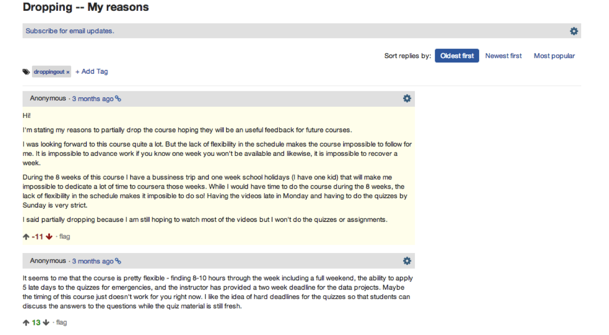

## Teaching statistics for the future
### Outline of the talk
1. Who the heck am I?
2. A brief taxonomy and history of online educational models
3. Massive Open Online Courses (MOOCs) 
4. Novel moving target directions of the field statistics
5. JHU Biostat involvement in Coursera
6. **Data Science series** (bulk of the talk)
7. SWIRL

---
## About these slides
* HTML5 using (customized) [Google io2012 style](https://code.google.com/p/io-2012-slides/)
* Created using [slidify](http://slidify.org)
* Appear on github at ?????, fork if you'd like
* Jointly written with my collaborators Jeff Leek and Roger Peng
* CC licensed by-nc-sa

---
## Core team

---
## Plus generous contributions from the
- [Department of Biostatistics](http://www.biostat.jhsph.edu)
- [Center for Teaching and Learning](http://www.jhsph.edu/offices-and-services/center-for-teaching-and-learning/)
- [Bloomberg School of Public Health](http://www.jhsph.edu)
- [Johns Hopkins University](http://www.jhu.edu)
- [Coursera](http://coursera.org)
- Team SWIRL
- Lauren and Ethan (Brian's 2013 interns)
- Contributions from github pull requests
- Tolerant families!
- A half of a million intrepid self learners

---
## My day job(s)
### SMART (www.smart-stats.org)

---
## Connectomics
### resting state fMRI

 

---
## JHU Biostat onsite degree programs

1. PhD program 
  - Around 50 students with around 10 matriculating per year.
  - Around 200 applications per year.
2. ScM program
  - Around 25 students with around 10 matriculating per year.
  - Around 50 applications per year. 
3. Concurrent MHS program
  - Typically around 10 students with around 2 matriculating per year.
  - 2 - 4 applications per year 
4. Standalone MHS program

---
## My person teaching

- Biostat 751 and 2 
  - 16 weeks (8 x 2) of classes
  - Two 80 minute lectures per week
  - Two tests per term
  - Four homeworks per term
  - One TA
- About 10 students
- Covers intro methods and  (mostly) linear models at the doctoral level
- Recently I've introduced the flipped classroom model

--- &twocol w1:50% w2:50%
## (Incomplete) characteristics of educational systems

*** =left
- Online / in person / blended
- Active/participatory/interactive learning
- Scalable / non-scalable
- Low cost / high cost / freemium
- Student paced / teacher paced
- Open / restricted access

*** =right
- Flipped / lecture style / blended 
- Open / closed source content
- Instructor interaction
- Credentialing 
- Funding model

---
## Examples
> - Traditional in person teaching generally has characterists of: in person, lecture style, non-scalable, high cost, restricted access with a large amount of instructor interaction valued credentialing
> - "Tranditional" online courses are online or blended online and in person and otherwise try to approximate tranditional in person classes. 
> - Online interactive learning (OIL Code School, Code academy) pimary characteristics are student-paced interactive learning
> - Intelligent tutoring systems (SWIRL), like OILs just not online
> - Khan Academy is online, interactive, scalable and low cost
> - Other modalities : iTunes U, OpenCourseware, Udemy

---
## MOOCs 

Primary characteristics are open access, low cost, scalable, online 

### (every letter is negotiable, from Wikipedia citing Mathieu Plorde)

---
## Most visible MOOC instruction sites

---
## Also
### Several university/organization-specific sites, platforms and content delivery systems
- Stanford, CMU, Duke, Harvard, MIT, google ...
- Varying degrees of content/delivery
- EdX platform has been open sourced
- Google course builder (now contributing to EdX)
- Massive amount of development going into platforms and instruction sites/portals ()

---
## Coursera platform, videos

---
## Coursera platform, quizzes

---
## Coursera platform, peer grading

---
## Coursera platform, forums

---
## Coursera platform, forums

---
## Statistics, big data, data science

---
## Statistics With Interactive R Learning
### [http://swirlstats.com](http://swirlstats.com)

---

---
